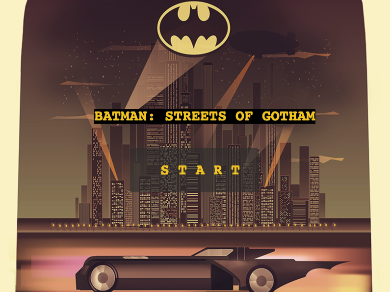
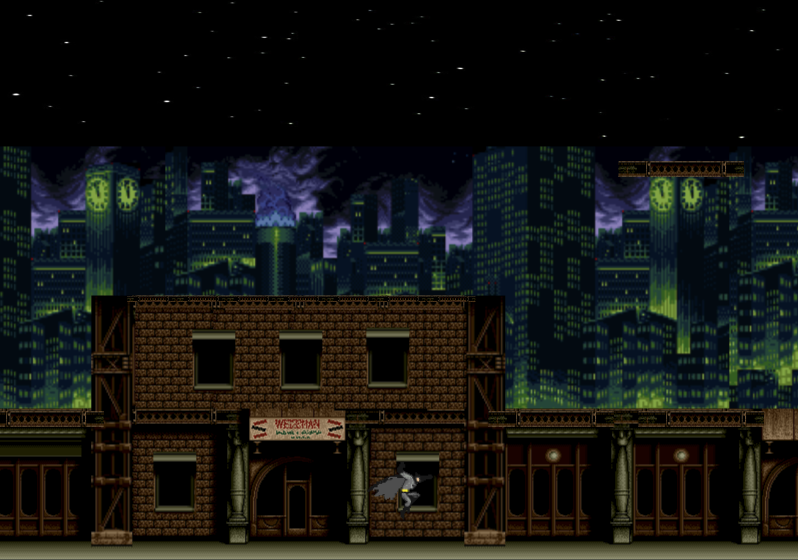

# BATMAN: STREETS OF GOTHAM




**A browser-based 2D side-scrolling beat-em-up / platformer built with Phaser 3 and TypeScript.** Batman patrols Gotham's most dangerous neighborhoods — fighting gangs, rescuing civilians, and cleaning up the streets one episode at a time.

## The Rewrite

In early 2026, the entire codebase was rewritten from scratch by **Claude Opus 4.6 Thinking Max** (Anthropic) in collaboration with the project maintainer(me, @AKolumbic, fml it's depressing to write that). The original game was a single-scene prototype with basic movement; the rewrite transformed it into a fully architected, data-driven, multi-episode experience with combat, enemy AI, NPC rescue mechanics, parallax scrolling, and a cinematic episode intro system.

The rewrite migrated from Rollup to **Vite**, restructured the project into a clean modular architecture (entities, systems, scenes, UI), and introduced 8 playable episodes — each with unique noir-flavored narration, themed city backgrounds, and distinct enemy/NPC placement.

The original implementation is preserved on the [`archive/original-impementation`](../../tree/archive/original-impementation) branch for historical reference.

## Episodes

| #   | Title                  | Neighborhood |
| --- | ---------------------- | ------------ |
| 1   | Return to Crime Alley  | Crime Alley  |
| 2   | The Rat King's Kingdom | The Narrows  |
| 3   | No Honor Among Thieves | East End     |
| 4   | Ashes and Alibis       | Burnley      |
| 5   | Neon and Gunpowder     | The Bowery   |
| 6   | A Crooked Mile         | Coventry     |
| 7   | Where the Fallen Sleep | Old Gotham   |
| 8   | The Devil You Know     | Chinatown    |

## Controls

| Action     | Keys                       |
| ---------- | -------------------------- |
| Move Left  | `A` / `Left Arrow`         |
| Move Right | `D` / `Right Arrow`        |
| Jump       | `W` / `Up Arrow` / `Space` |
| Crouch     | `S` / `Down Arrow`         |
| Punch      | `1`                        |

## Getting Started

### Requirements

[Node.js](https://nodejs.org) (v18+) is required to install dependencies and run scripts via `npm`.

### Commands

| Command              | Description                                 |
| -------------------- | ------------------------------------------- |
| `npm install`        | Install project dependencies                |
| `npm run dev`        | Start Vite dev server with HMR (port 10001) |
| `npm run build`      | Production build (output to `dist/`)        |
| `npm run preview`    | Preview the production build                |
| `npm run typecheck`  | TypeScript type checking (`tsc --noEmit`)    |
| `npm run lint`       | ESLint                                      |
| `npm run test`       | Vitest unit tests                           |

## Architecture

**Engine:** Phaser 3.60 | **Language:** TypeScript 5 | **Bundler:** Vite 6 | **Canvas:** 800x600 | **Physics:** Arcade (gravity 300)

**Entry point:** `src/game.ts` creates the Phaser.Game instance.

### Scene Flow

```
Boot (loading bar)
  ↓
GameMenu (title screen, pan-down animation, intro music)
  ↓
LevelSelect (8 episodes in 2×4 grid)
  ↓
EpisodeIntro (cinematic: episode number → noir title → typewriter narration → "PRESS SPACE")
  ↓
GameLevel (generic gameplay scene, loads any level by ID)
  ├──→ LevelComplete (victory: score, rescued count)
  └──→ GameOver (defeat: retry / level select)
```

### Directory Structure

```
src/
  constants/
    assets.ts              # Centralized asset keys + paths (all asset references)
    physics.ts             # Gravity, speeds, hitbox sizes, HP values
  controls/
    controls.utils.ts      # Animation registration + input key bindings
  data/
    levels/
      index.ts             # Level registry (LEVELS object + LEVEL_ORDER array)
      level-01.json        # Data-driven level definitions (×8 episodes)
      level-02.json
      level-03.json
      level-04.json
      level-05.json
      level-06.json
      level-07.json
      level-08.json
      levels.test.ts       # Level data validation tests
  entities/
    Batman.ts              # Player class: state machine, HP, punch hitbox, scoring
    Enemy.ts               # Base enemy class: patrol AI, attack, damage, death
    NPC.ts                 # Rescuable civilian NPC: auto-rescue, flee behavior
    enemies/
      GangsterMelee.ts     # Close-range gangster (Gangsters_1/2 sprite variants)
      GangsterRanged.ts    # Ranged gangster with bullets (Gangsters_3 sprites)
  scenes/
    Boot.ts                # Loading bar, transitions to GameMenu
    GameMenu.ts            # Title screen with pan-down animation
    LevelSelect.ts         # Episode picker (8 areas, 2×4 grid)
    EpisodeIntro.ts        # Cinematic intro with typewriter narration
    GameLevel.ts           # Generic gameplay scene (accepts { levelId } init data)
    LevelComplete.ts       # Victory screen with score/rescue stats
    GameOver.ts            # Defeat screen with retry/level select
    index.ts               # Scene registry
  systems/
    AssetLoader.ts         # Centralized gameplay asset preloading
    LevelLoader.ts         # Parse level JSON, create platforms + backgrounds + floor
    TilemapManager.ts      # Tiled JSON tilemap support (infrastructure ready)
    ParallaxBackground.ts  # Multi-layer parallax scrolling (5 layers, 8 themes)
  ui/
    HUD.ts                 # Health bar, score display, rescue counter
    Button.ts              # Reusable button component with hover effects
    DialogueBox.ts         # Text dialogue box with fade-in/out
  game.ts                  # Phaser.Game entry point
```

### Key Systems

- **Data-Driven Levels** — All level layouts, enemy/NPC spawns, backgrounds, and narration are defined in JSON files. Optional `floor` field tiles a full-width ground via `createFloor()`. Adding a new episode means adding a new JSON file and registering it in `index.ts`.
- **Parallax Backgrounds** — 5-layer scrolling with 8 city themes (day/night variants). Scroll factors range from 0 (fixed sky) to 0.8 (foreground).
- **Combat** — Batman has a punch hitbox (40px range) that detects overlap with enemies. Enemies take damage, play hurt animations, and die after 3 hits.
- **Enemy AI** — Enemies patrol between defined bounds. When Batman enters range, they switch to attack mode (melee or ranged). Ranged gangsters fire bullets with a 2.5s cooldown.
- **NPC Rescue** — Civilians auto-rescue when Batman is within 80px. They play a celebration animation and flee off-screen. Each rescue awards 150 points.
- **Episode Intros** — Cinematic interstitials with fade-in title text and typewriter narration, creating a noir atmosphere.
- **HUD** — Health bar (color-coded by HP%), score counter, and rescue tracker, all fixed to camera.

### Asset Organization

Assets live in `public/assets/` (copied to `dist/assets/` at build time).

- `public/assets/imgs/` — All images and sprite sheets
  - Root PNGs: Batman sprites, backgrounds, platforms
  - `gangster-pixel-character-sprite-sheets-pack/` — 3 gangster enemy types (128×128 frames)
  - `Free-Homeless-Character-Sprite-Sheets-Pixel-Art/` — 3 homeless NPC types (128×128 frames)
  - `free-scrolling-city-backgrounds-pixel-art/` — 8 city themes × day/night × 5 parallax layers
  - `GandalfHardcore City Tiles/` — 32×32 tile sets for tilemap-based levels
  - `Game UI collection FREE version/` — Bars, buttons, dialogue boxes, icons
- `public/assets/audio/` — Music files (MP3 + OGG)

### Key Conventions

- All asset paths are defined in `src/constants/assets.ts` — never hardcode paths elsewhere
- Physics constants live in `src/constants/physics.ts`
- Level layouts are data-driven via JSON files in `src/data/levels/`; register new levels in `index.ts`
- `LevelData` includes an optional `floor` field; `createFloor()` tiles it across `worldWidth`
- `GameLevel` accepts `{ levelId: string }` in scene init data and loads the matching entry from `LEVELS`
- Enemy subclasses extend `Enemy` and pass `EnemySpriteOptions` to `super(config, options)`

## Code Style

- **ESLint + Prettier:** 2-space indent, single quotes, semicolons, Unix line endings (LF)
- **TypeScript:** strict mode, ESNext target, bundler module resolution
- **Patterns:** functional components for UI, class-based for entities and scenes

## Current Stack

| Dependency | Version |
| ---------- | ------- |
| Phaser     | 3.60    |
| TypeScript | 5.0.3   |
| Vite       | 6.4.1   |
| ESLint     | 8.41.0  |

## License

MIT

---

## Acknowledgments

This project stands on the shoulders of the people who built its foundation.

### Original Hackathon Team (Lambda School, Summer 2018)

The original game concept was born at **Lambda School's 2018 Summer Hackathon**. A special thank you to the team that made it happen:

- **Alex Dykas**
- **Thuy Pham**
- **Brandon Benefield**
- **Brandon Hopper**

[Instagram Story from the Hackathon](https://www.instagram.com/p/CiympKMD-K4/)

### Phaser Template

The project was originally bootstrapped from the official [Phaser 3 TypeScript + Rollup template](https://github.com/photonstorm/phaser3-typescript-project-template) maintained by **Richard Davey** ([@photonstorm](https://github.com/photonstorm)), creator of Phaser.

### AI-Assisted Rewrite

The v2.0 rewrite was performed by **Claude Opus 4.6 Thinking Max** (Anthropic), working in collaboration with the project maintainer, Andrew Kolumbic. The rewrite was done via the `ai/opus-4.6` branch and merged via [PR #3](../../pull/3).

---

## Historical Reference: Original README

> The content below is the original README from the v1.x implementation, preserved here for posterity. The original codebase is available on the [`archive/original-impementation`](../../tree/archive/original-impementation) branch.

---

### BATMAN: STREETS OF GOTHAM (v1.x)

Begin the experience as the Dark Knight of Gotham on this Batman platformer. This game was quick-started using a template that combines Phaser 3.60 with [TypeScript 5](https://www.typescriptlang.org/) and uses [Rollup](https://rollupjs.org) for bundling and heavily reuses code from [this hackathon project](https://github.com/udykas/batman-hackathon) as a starting point.

#### A special thank you to Alex Dykas, Thuy Pham, Brandon Benefield, and Brandon Hopper for their work in Lambda School's 2018 Summer Hackathon. [Instagram Story from the Hackathon](https://www.instagram.com/p/CiympKMD-K4/)

#### Controls:

```
Move Left - A / Left arrow

Move Right - S / Right arrow

Jump - W / Up arrow
```

#### Requirements

[Node.js](https://nodejs.org) is required to install dependencies and run scripts via `npm`.

#### Available Commands

| Command         | Description                                                                       |
| --------------- | --------------------------------------------------------------------------------- |
| `npm install`   | Install project dependencies                                                      |
| `npm run watch` | Build project and open web server running project, watching for changes           |
| `npm run dev`   | Builds project and open web server, but do not watch for changes                  |
| `npm run build` | Builds code bundle with production settings (minification, no source maps, etc..) |

#### Versions Used

- Phaser 3.60
- TypeScript 5.0.3
- Rollup 3.20.2
- Rollup Plugins:
  - @rollup/plugin-commonjs 24.0.1
  - @rollup/plugin-node-resolve 15.0.2
  - @rollup/plugin-replace 5.0.2
  - @rollup/plugin-terser 0.4.0
  - @rollup/plugin-typescript 11.1.0
  - rollup-plugin-serve 2.0.2
